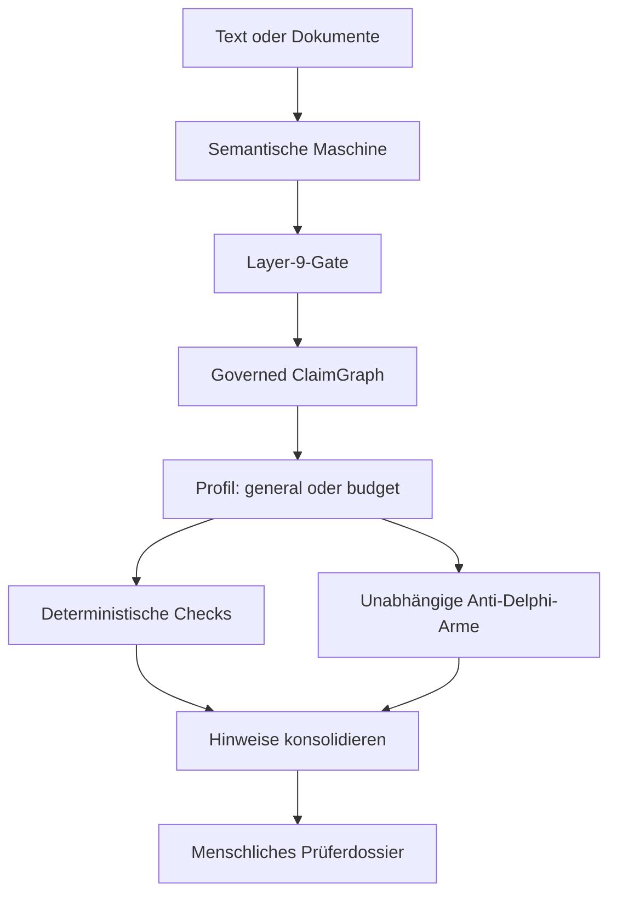

# Content Review — Alpha

Content Review prüft die **inhaltliche Tragfähigkeit** eines Textes unabhängig
von Stil, Formatierung oder vermuteter Autorenschaft. Es ist ausdrücklich kein
KI-Detektor: Ein glatter LLM-Text erhält keinen Bonus, ein holpriger menschlicher
Text keinen Malus.

Die semantische Maschine zerlegt den Text zuerst in atomare Aussagen mit exakten
Originalstellen und ordnet sie in einem typisierten ClaimGraph an. Erst danach
prüfen deterministische Regeln und unabhängige Anti-Delphi-Arme die Verbindungen.
Die letzte Bewertung bleibt beim Menschen.

Das frühere Budget Review ist als spezialisiertes Profil vollständig erhalten.

## Architektur



Das LLM ist nur ein Sensor. Das deterministische Gate lässt ausschließlich
Aussagen mit exakter Originalstelle, geschlossenem Typ, ausreichender Konfidenz
und gültiger Provenienz in den Graphen. Kein Modell und keine Regel kann eine
Aussage auf „wahr“ setzen.

## Prüfprofile

| Profil | Prüft | Prüft ausdrücklich nicht |
|---|---|---|
| `general` | Argumentstruktur, Evidenzbezug, logische Lücken, Widersprüche, Kausalität, Scope- und Begriffswechsel, Verallgemeinerungen | Stilqualität, Formatierung, KI-Autorenschaft, externe Wahrheit |
| `budget` | zusätzlich Kapazität, Ressourcen, Prozentangaben, FTE und Budgetsumme | Förderentscheidung |

`general` ist der Standard. Das Budgetprofil verwendet denselben semantischen
Kern und ergänzt domänenspezifische Claim-Typen, Reviewer-Rollen und Rechenregeln.

## Was die Alpha kann

- Markdown, Text, CSV, TSV und DOCX einlesen; optional PDF und XLSX;
- Thesen, Tatsachenbehauptungen, Definitionen, Annahmen, Evidenz,
  Schlussfolgerungen, Prognosen, Werturteile, Empfehlungen und Einschränkungen
  als atomare Claims extrahieren;
- Relationen wie `SUPPORTS`, `CONTRADICTS`, `EVIDENCED_BY`, `QUALIFIES`,
  `GENERALIZES`, `EXAMPLE_OF` und `ENTAILS` abbilden;
- zwei getrennte DeepSeek-V4-Flash-Arme nutzen: einmal ohne und einmal mit
  Thinking;
- überlappende Reviewer-Meldungen zu einer kurzen menschlichen Prüfwarteschlange
  konsolidieren;
- eine eigenständige HTML-Ansicht mit Inhaltsgerüst und priorisierten
  Prüfpunkten, Markdown und einen vollständigen JSON-Audit erzeugen;
- alte Semantic Packets aus Budget Review `0.1` weiterhin einlesen.

## Schnellstart ohne API

Python 3.11 oder neuer:

```bash
python -m venv .venv
source .venv/bin/activate
pip install -e .
content-review demo
content-review demo --case rough
```

Die beiden eingefrorenen Gegenproben zeigen die Trennung von Form und Inhalt:

- `polished`: 5 Claims, 5 Relationen, 3 strukturelle Prüfhinweise;
- `rough`: 4 Claims, 4 Relationen, 0 strukturelle Prüfhinweise.

Null Hinweise sind kein positives Urteil; sie bedeuten nur, dass die konservativen
Offline-Regeln in diesem Graphen keine der definierten Spannungen fanden.

Die menschliche Ansicht liegt unter `review-output/demo/dossier.html`. Markdown
und der vollständige JSON-Audit werden daneben erzeugt.

## Einen Text live prüfen

Der Schlüssel wird ausschließlich aus `DEEPSEEK_API_KEY` gelesen und nie in
Logs oder Dateien geschrieben:

```bash
export DEEPSEEK_API_KEY='...'
content-review review essay.md \
  --profile general \
  --provider deepseek \
  --live-review \
  --output review-output/essay
```

Für PDF/XLSX zuerst die optionalen Dokumentabhängigkeiten installieren:

```bash
pip install -e '.[documents]'
```

## Budgetprofil

```bash
content-review review antrag.pdf budget.xlsx \
  --profile budget \
  --provider deepseek \
  --live-review \
  --output review-output/antrag
```

Der bisherige Befehl `budget-review` bleibt als kompatibler Alias erhalten.
Bei bereits extrahierten Dokumenten kann mit `--packet semantic_packet.json`
vollständig offline gearbeitet werden.

## DeepSeek-Konfiguration

Die Alpha extrahiert standardmäßig mit `deepseek-v4-flash`. Anti-Delphi
kombiniert einen Flash-Arm ohne Thinking, einen unabhängigen Flash-Arm mit
Thinking und die lokalen deterministischen Regeln. Das ist Perspektivtrennung,
keine behauptete Modellvielfalt.

GitHub Actions liest das vorhandene Repository-Secret `Deepseekapisecret` und
reicht es intern als `DEEPSEEK_API_KEY` weiter. Der normale CI-Lauf ist
vollständig offline. Der kostenpflichtige Live-Smoke-Test wird nur manuell über
**Actions → Live DeepSeek smoke test → Run workflow** gestartet.

## Autoritätsgrenzen

| Schicht | Darf | Darf nicht |
|---|---|---|
| Extraktor | Claims und Relationen vorschlagen | Wahrheit, Stil oder Autorenschaft bewerten |
| Layer-9-Gate | Schema, Spans, IDs, Konfidenz und Kanten prüfen | Lücken schließen oder Claims erfinden |
| Regelprüfer | explizite Graph- und Zahlenbeziehungen prüfen | ungenannte Annahmen ergänzen |
| Anti-Delphi | Inhaltsprobleme und Prüffragen vorschlagen | Gesamturteil oder Mehrheitsvotum abgeben |
| Mensch | Originalstellen, Belege und Bedeutung prüfen | — |

Die vollständigen Verträge stehen in [docs/architecture.md](docs/architecture.md).

## Tests

```bash
pip install -e '.[dev,documents]'
pytest
ruff check .
```

## Alpha-Grenzen

- Das allgemeine Profil prüft zunächst interne Tragfähigkeit, nicht die Wahrheit
  externer Tatsachen. Quellenrecherche bleibt eine getrennte spätere Schicht.
- Ein leerer oder unvollständiger ClaimGraph ist kein positives Prüfergebnis.
- Die Qualität der Live-Extraktion ist modell- und domänenabhängig.
- PDF-Textextraktion enthält kein OCR.
- Übereinstimmung der Reviewer ist keine Wahrheit und kein Qualitätswert.

Status: `0.2.0a1` · Research alpha · MIT
