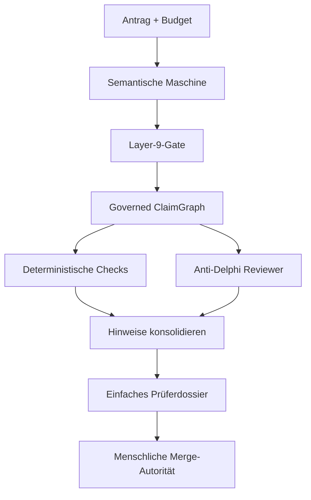

# Budget Review — Alpha

Budget Review zerlegt sprachlich perfekte Förder- und Budgetanträge in eine
prüfbare Struktur. Es soll das Problem des **Kohärenztheaters** reduzieren:
Ein LLM kann einzelne Aussagen so glatt verbinden, dass ein plausibler Text
entsteht, obwohl Ziele, Kapazitäten, Annahmen und Zahlen nicht zusammenpassen.

Die Alpha erteilt **keine Förderentscheidung**. Sie bereitet die Claims für
einen menschlichen Prüfer vor und hält jede maschinelle Aussage auditierbar.

## Architektur



Das LLM ist nur ein Sensor. Das deterministische Gate lässt ausschließlich
Claims mit exaktem Originalspan, geschlossenem Typ, ausreichender Konfidenz
und gültiger Provenienz in den Graphen. Relationen werden erst danach
zugelassen, wenn beide Endpunkte existieren. Weder Gate noch Reviewer können
einen Claim auf „wahr“ setzen.

## Was die Alpha kann

- Eingabe: Markdown, Text, CSV, TSV und DOCX; optional PDF und XLSX.
- atomare Claim-Extraktion über die aktuelle DeepSeek API;
- geschlossene Claim- und Relationstypen mit Originalspans und Hash-Provenienz;
- deterministisches Layer-9-Gate mit replay-stabilen IDs;
- Rechenprüfungen für Kapazität, Prozentangaben, FTE, Budgetsumme und Ressourcen;
- zwei getrennte DeepSeek-V4-Flash-Arme auf dem ClaimGraph: einmal ohne und
  einmal mit Thinking;
- Anti-Delphi-Ausgabe ohne Abstimmungsfiktion: Widerspruch bleibt sichtbar,
  Übereinstimmung ist nur eine Prüfpriorität;
- zusammengeführte Prüfpunkte statt doppelter Reviewer-Meldungen;
- einfache Prüferansicht als eigenständige HTML-Seite mit Prioritäten,
  einklappbaren Originalaussagen und klaren Prüffragen;
- Markdown-Export und vollständiger Audit als JSON;
- eingefrorener Kontrollfall mit 25 Claims, 15 Relationen und 8 versteckten Fehlern.

## Schnellstart ohne API

Python 3.11 oder neuer:

```bash
python -m venv .venv
source .venv/bin/activate
pip install -e .
budget-review demo
```

Erwartetes Ergebnis:

```text
Frozen control: 25 claims, 15 relations, 8 consolidated review points from 8 raw findings.
```

Die menschliche Ansicht liegt danach unter `review-output/demo/dossier.html`.
Markdown und der vollständige JSON-Audit werden daneben erzeugt.

## Live mit DeepSeek

Der Schlüssel wird ausschließlich aus `DEEPSEEK_API_KEY` gelesen und nie in
Logs oder Dateien geschrieben:

```bash
export DEEPSEEK_API_KEY='...'
budget-review review antrag.pdf budget.xlsx \
  --provider deepseek \
  --live-review \
  --document-id mein-antrag \
  --output review-output/mein-antrag
```

Für PDF/XLSX zuerst die optionalen Dokumentabhängigkeiten installieren:

```bash
pip install -e '.[documents]'
```

Bei einer getrennten Extraktion oder für einen reproduzierbaren Replay kann
ein eingefrorenes Semantic Packet benutzt werden:

```bash
budget-review review antrag.md \
  --packet semantic_packet.json \
  --provider offline
```

## DeepSeek-Konfiguration

Die Alpha verwendet den aktuellen Chat-Completions-Endpunkt. Standardmäßig
extrahiert `deepseek-v4-flash`; Anti-Delphi kombiniert einen Flash-Arm ohne
Thinking, einen unabhängigen Flash-Arm mit Thinking und die lokalen
deterministischen Rechenprüfungen. Die Alpha behauptet damit keine
LLM-Modellvielfalt: Die Trennung besteht aus Prüfrolle und Inferenzmodus.

In diesem Repository liest GitHub Actions den vorhandenen Repository-Secret
`Deepseekapisecret` und reicht ihn intern als `DEEPSEEK_API_KEY` weiter.
Der normale CI-Lauf ist vollständig offline. Der kostenpflichtige Live-Smoke-
Test wird nur manuell über **Actions → Live DeepSeek smoke test → Run workflow**
gestartet.

## Datenverträge

| Schicht | Darf | Darf nicht |
|---|---|---|
| Extraktor | Claims/Relationen vorschlagen | Wahrheit oder Förderfähigkeit bewerten |
| Layer-9-Gate | Schema, Spans, IDs, Konfidenz und Kanten prüfen | Text „verstehen“ oder fehlende Claims erfinden |
| Rechenprüfer | explizite Zahlenbeziehungen nachrechnen | ungenannte Annahmen ergänzen |
| Anti-Delphi | Prüfprobleme und Fragen vorschlagen | Fördervotum abgeben |
| Mensch | Belege prüfen und Entscheidung treffen | — |

Die vollständigen Verträge stehen in [docs/architecture.md](docs/architecture.md).

## Tests

```bash
pip install -e '.[dev,documents]'
pytest
ruff check .
```

## Alpha-Grenzen

- Die Qualität der Live-Extraktion ist modell- und domänenabhängig. Ein leerer
  oder unvollständiger Graph ist **kein** positives Prüfergebnis.
- PDF-Textextraktion enthält kein OCR. Gescannte Dokumente müssen vorher OCR
  erhalten.
- Die Rechenregeln decken häufige Muster ab, nicht jede Budgetlogik.
- Zwei getrennte Läufe desselben DeepSeek-Modells sind keine Modell- oder
  Anbieterdiversität. Weitere Provider können über denselben Adaptervertrag
  ergänzt werden.
- Das System prüft interne Kohärenz und Evidenzlücken; externe Tatsachen und
  Originalbelege bleiben Aufgabe des Prüfers.

Status: `0.1.0a2` · Research alpha · MIT
