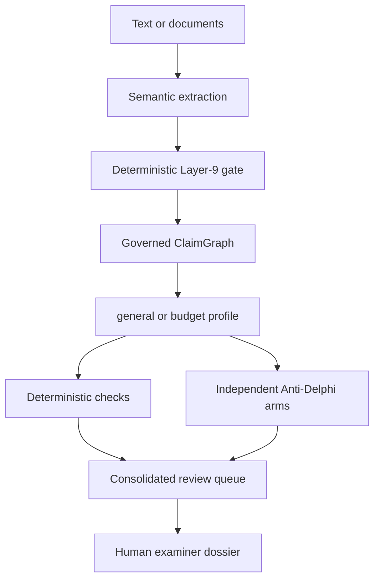
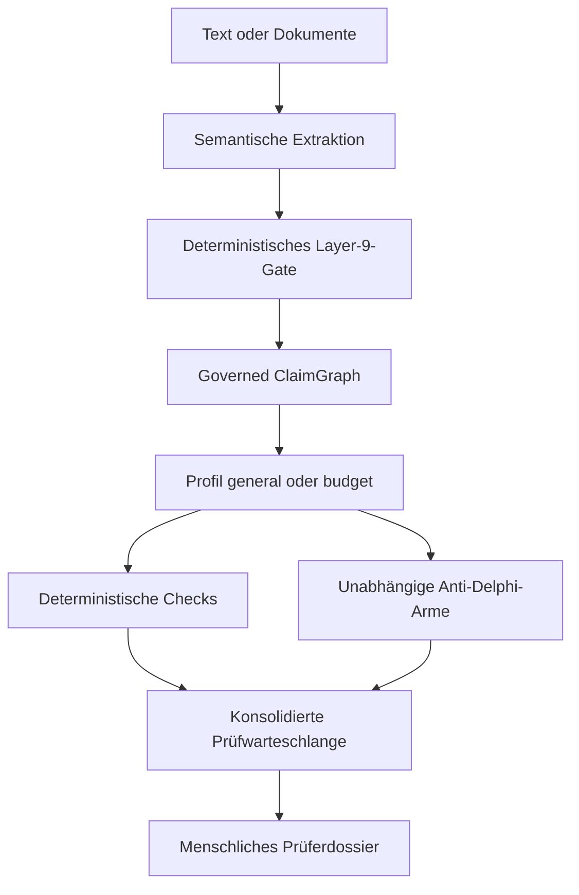

# Content Review

**An auditable content reviewer built on claims, not prose quality.**

[English](#english) · [Deutsch](#deutsch)

Content Review is a research alpha that helps a human examiner inspect the
internal substance of polished texts and proposals. It first decomposes the
source into atomic claims and typed relations. Only then do deterministic checks
and two independent Anti-Delphi reviewer arms look for contradictions, missing
support, overgeneralization, scope shifts and other tensions.

It is deliberately **not an AI detector**. Smooth writing receives no bonus,
rough writing no penalty. The system produces review questions, never a truth,
quality or funding verdict.

Status: `0.2.0a3` · Research alpha · MIT

---

## English

### What the examiner receives

The human-facing dossier starts with the content map and a short, prioritized
review queue. Each point contains:

- the issue and its severity;
- a concrete question for the examiner;
- the original claims and exact source wording;
- the reviewer paths that raised the issue;
- a technical audit with hashes, model provenance and rejected proposals.

The same run also writes Markdown and a complete machine-readable JSON audit.
Agreement between reviewers is recorded as overlap, not treated as truth.

### Quick start: local web interface

Requirements: Python 3.11 or newer.

```bash
git clone https://github.com/hstre/Budget-Review.git
cd Budget-Review
python -m venv .venv
source .venv/bin/activate
pip install -e .
content-review web
```

On Windows PowerShell, activate the environment with:

```powershell
.venv\Scripts\Activate.ps1
```

The app opens at `http://127.0.0.1:8765` and provides German and English
navigation, settings, review controls and dossier labels.

Open **Settings** to add, replace or remove your DeepSeek API key. If no key is
available, the first live review directs you there automatically. Paste a text,
choose `general` or `budget`, and start the review. A live run may take a few
minutes.

Every completed web review also writes its full dossier to
`./review-output/web/<document>-<timestamp>/`, relative to the directory the
server was started in. `dossier.json` contains the verbatim wording of every
admitted claim, so place that directory accordingly.

### API-key handling

The local web interface stores one key per operating-system user in:

```text
~/.config/content-review/settings.json
```

The file is written atomically and set to `0600` on POSIX systems; Windows has
no equivalent and relies on the user profile ACL. The complete key is not
returned to the browser, written to dossiers or included in logs. It is stored
locally as plain text protected by the operating-system file permissions, not
encrypted. `DEEPSEEK_API_KEY` remains available as a fallback for CLI use.

The server binds to `127.0.0.1` by default. Binding to another address requires
the explicit `--allow-network` flag. This is a safety barrier, not multi-user
authentication: place a real authentication layer in front of the app before any
shared or public deployment.

### Try the offline controls

No API key is needed for the frozen controls:

```bash
content-review demo
content-review demo --case rough
content-review demo --profile budget --language en
```

They test the intended separation of form and content:

| Control | Governed graph | Deterministic result |
|---|---:|---:|
| `polished` | 5 claims, 5 relations | 3 structural findings |
| `rough` | 4 claims, 4 relations | 0 structural findings |

Zero findings are not a positive verdict. They only mean that the conservative
offline rules found none of their defined tensions in that graph.

### Review profiles

| Profile | Inspects | Explicitly does not inspect |
|---|---|---|
| `general` | argument structure, evidence links, logical gaps, contradictions, causality, scope and definition shifts, overgeneralization | writing quality, formatting, suspected AI authorship, external truth |
| `budget` | all general graph controls plus capacity, resources, percentages, FTE and budget totals | the funding decision |

`general` is the default. `budget` preserves and extends the original Budget
Review specialization on the same governed semantic core.

### How it works



The LLM is a sensor, not an authority. The gate admits only closed claim and
relation types with valid provenance, sufficient confidence and exact source
anchors. A malformed relation is rejected individually and recorded in the
audit; it is never silently converted into a guessed relation. No component can
set a claim to “true”.

The two live reviewer arms both currently use `deepseek-v4-flash`: one without
Thinking and one with Thinking. This creates perspective separation, not claimed
model diversity. Deterministic rules form the third path.

### Supported input and output

The CLI reads TXT, Markdown, CSV, TSV and DOCX. PDF and XLSX require the optional
document dependencies:

```bash
pip install -e '.[documents]'
```

Every completed review writes:

```text
dossier.html   human-facing review queue
dossier.md     portable text report
dossier.json   complete claims, relations, findings, provenance and rejections
```

### CLI examples

General content review:

```bash
export DEEPSEEK_API_KEY='...'
content-review review essay.md \
  --profile general \
  --provider deepseek \
  --live-review \
  --output review-output/essay
```

Proposal and budget review:

```bash
content-review review proposal.pdf budget.xlsx \
  --profile budget \
  --provider deepseek \
  --live-review \
  --language en \
  --output review-output/proposal
```

`--language de|en` sets the dossier language for HTML, Markdown and the reviewer
arms. Without it the stored interface language is used.

The old `budget-review` command remains as a compatible alias. A previously
extracted semantic packet can be reviewed offline with `--packet`.

### Authority boundaries

| Layer | May | Must not |
|---|---|---|
| Extractor | propose claims and relations | judge truth, style or authorship |
| Layer-9 gate | verify schema, spans, IDs, confidence and edges | repair gaps or invent claims |
| Deterministic checks | inspect explicit graph and numeric relations | add unstated assumptions |
| Anti-Delphi reviewers | propose content problems and review questions | issue an overall or majority verdict |
| Human examiner | inspect wording, evidence and meaning; make the final decision | — |

The full contracts are documented in [docs/architecture.md](docs/architecture.md).

### Tests

```bash
pip install -e '.[dev,documents]'
pytest
ruff check .
```

CI runs fully offline on Python 3.11, 3.12 and 3.13. The paid DeepSeek smoke test
is a separate manually triggered GitHub Action.

### Alpha limitations

- The general profile inspects internal support, not the external truth of facts.
- Empty or incomplete ClaimGraphs are not positive results. Every run reports
  how much of the source its admitted claims are anchored to and names the
  passages none of them reach, but whether such a passage should have carried a
  claim is a question for the examiner, not a verdict.
- Live extraction quality remains model- and domain-dependent.
- The web alpha accepts pasted text; document upload remains a CLI feature.
- PDF extraction has no OCR.
- The dossier is rendered in German or English: interface labels, deterministic
  findings and the reviewer arms all follow `--language` (default: the stored
  interface setting). Quoted claims keep their original wording, since they are
  verbatim spans from the source.
- The local web server is single-user and has no account system.

Security details are collected in [SECURITY.md](SECURITY.md); changes per
release are in [CHANGELOG.md](CHANGELOG.md).

---

## Deutsch

### Was der Prüfer erhält

Das menschliche Dossier beginnt mit dem Inhaltsgerüst und einer kurzen,
priorisierten Prüfwarteschlange. Jeder Prüfpunkt enthält:

- Problem und Dringlichkeit;
- eine konkrete Frage für den Prüfer;
- die betroffenen Claims mit dem exakten Originalwortlaut;
- die Prüfwege, die den Hinweis erzeugt haben;
- einen technischen Audit mit Hashes, Modellprovenienz und Rejections.

Daneben entstehen eine Markdown-Fassung und ein vollständiger
maschinenlesbarer JSON-Audit. Übereinstimmung zwischen Reviewern wird als
Überlappung dokumentiert, aber nicht als Wahrheit behandelt.

### Schnellstart: lokale Weboberfläche

Voraussetzung ist Python 3.11 oder neuer.

```bash
git clone https://github.com/hstre/Budget-Review.git
cd Budget-Review
python -m venv .venv
source .venv/bin/activate
pip install -e .
content-review web
```

Unter Windows PowerShell wird die Umgebung so aktiviert:

```powershell
.venv\Scripts\Activate.ps1
```

Die Anwendung öffnet `http://127.0.0.1:8765`. Navigation, Einstellungen,
Bedienelemente und Dossier-Bezeichnungen stehen auf Deutsch und Englisch zur
Verfügung.

Unter **Einstellungen** lässt sich der eigene DeepSeek API-Key eintragen,
ersetzen oder entfernen. Fehlt ein Schlüssel, führt die erste Live-Prüfung
automatisch dorthin. Anschließend Text einfügen, das Profil `general` oder
`budget` wählen und die Prüfung starten. Ein Live-Lauf kann einige Minuten
dauern.

Jede abgeschlossene Web-Prüfung schreibt ihr vollständiges Dossier zusätzlich
nach `./review-output/web/<dokument>-<zeitstempel>/`, relativ zum
Startverzeichnis des Servers. `dossier.json` enthält den Originalwortlaut aller
zugelassenen Claims; das Verzeichnis sollte entsprechend gewählt werden.

### Umgang mit dem API-Key

Die lokale Weboberfläche speichert einen Schlüssel je Betriebssystem-Benutzer:

```text
~/.config/content-review/settings.json
```

Die Datei wird atomar geschrieben und auf POSIX-Systemen auf `0600` gesetzt;
Windows kennt keine Entsprechung und verlässt sich auf die ACL des
Benutzerprofils. Der vollständige Key wird nicht an den Browser zurückgegeben
und erscheint weder in Dossiers noch in Logs. Er liegt lokal als Klartext vor
und wird durch die Dateirechte des Betriebssystems geschützt; er ist nicht
verschlüsselt. Für die CLI bleibt
`DEEPSEEK_API_KEY` als Rückfall verfügbar.

Der Server bindet standardmäßig nur an `127.0.0.1`. Andere Adressen verlangen
den ausdrücklichen Schalter `--allow-network`. Das ersetzt keine
Benutzeranmeldung: Vor einer gemeinsamen oder öffentlichen Bereitstellung muss
eine echte Authentifizierung vorgeschaltet werden.

### Offline ausprobieren

Die eingefrorenen Gegenproben benötigen keinen API-Key:

```bash
content-review demo
content-review demo --case rough
content-review demo --profile budget --language en
```

| Gegenprobe | Governed Graph | Deterministisches Ergebnis |
|---|---:|---:|
| `polished` | 5 Claims, 5 Relationen | 3 strukturelle Hinweise |
| `rough` | 4 Claims, 4 Relationen | 0 strukturelle Hinweise |

Null Hinweise sind kein positives Urteil. Sie bedeuten lediglich, dass die
konservativen Offline-Regeln in diesem Graphen keine der definierten Spannungen
gefunden haben.

### Prüfprofile

| Profil | Prüft | Prüft ausdrücklich nicht |
|---|---|---|
| `general` | Argumentstruktur, Evidenzbezug, logische Lücken, Widersprüche, Kausalität, Scope- und Begriffswechsel, Verallgemeinerungen | Stilqualität, Formatierung, vermutete KI-Autorenschaft, externe Wahrheit |
| `budget` | zusätzlich Kapazität, Ressourcen, Prozentangaben, FTE und Budgetsumme | Förderentscheidung |

`general` ist der Standard. `budget` erhält und erweitert das frühere Budget
Review als Spezialprofil auf demselben semantischen Kern.

### Funktionsweise



Das LLM ist Sensor, nicht Autorität. Das Gate lässt nur geschlossene Claim- und
Relationstypen mit gültiger Provenienz, ausreichender Konfidenz und exakter
Originalstelle zu. Eine fehlerhafte Relation wird einzeln abgewiesen und im
Audit dokumentiert; sie wird niemals still in eine vermutete Relation
umgedeutet. Keine Komponente kann einen Claim auf „wahr“ setzen.

Beide Live-Reviewer verwenden derzeit `deepseek-v4-flash`: ein Arm ohne
Thinking, ein unabhängiger Arm mit Thinking. Das ist Perspektivtrennung, keine
behauptete Modellvielfalt. Die deterministischen Regeln bilden den dritten
Prüfweg.

### Eingaben und Ausgaben

Die CLI liest TXT, Markdown, CSV, TSV und DOCX. PDF und XLSX benötigen die
optionalen Dokumentabhängigkeiten:

```bash
pip install -e '.[documents]'
```

Jede abgeschlossene Prüfung erzeugt:

```text
dossier.html   menschliche Prüfwarteschlange
dossier.md     übertragbarer Textbericht
dossier.json   Claims, Relationen, Findings, Provenienz und Rejections
```

### CLI-Beispiele

Allgemeine Inhaltsprüfung:

```bash
export DEEPSEEK_API_KEY='...'
content-review review essay.md \
  --profile general \
  --provider deepseek \
  --live-review \
  --output review-output/essay
```

Antrags- und Budgetprüfung:

```bash
content-review review antrag.pdf budget.xlsx \
  --profile budget \
  --provider deepseek \
  --live-review \
  --language de \
  --output review-output/antrag
```

`--language de|en` bestimmt die Sprache von HTML, Markdown und den
Reviewer-Armen. Ohne den Schalter gilt die gespeicherte Oberflächensprache.

Der frühere Befehl `budget-review` bleibt als kompatibler Alias erhalten. Ein
bereits extrahiertes Semantic Packet kann mit `--packet` vollständig offline
geprüft werden.

### Autoritätsgrenzen

| Schicht | Darf | Darf nicht |
|---|---|---|
| Extraktor | Claims und Relationen vorschlagen | Wahrheit, Stil oder Autorenschaft bewerten |
| Layer-9-Gate | Schema, Spans, IDs, Konfidenz und Kanten prüfen | Lücken schließen oder Claims erfinden |
| Regelprüfer | explizite Graph- und Zahlenbeziehungen prüfen | ungenannte Annahmen ergänzen |
| Anti-Delphi | Inhaltsprobleme und Prüffragen vorschlagen | Gesamturteil oder Mehrheitsvotum abgeben |
| Mensch | Wortlaut, Belege und Bedeutung prüfen; endgültig entscheiden | — |

Die vollständigen Verträge stehen in [docs/architecture.md](docs/architecture.md).

### Tests

```bash
pip install -e '.[dev,documents]'
pytest
ruff check .
```

Die CI läuft unter Python 3.11, 3.12 und 3.13 vollständig offline. Der
kostenpflichtige DeepSeek-Smoke-Test ist davon getrennt und wird in GitHub
Actions manuell gestartet.

### Grenzen der Alpha

- Das allgemeine Profil prüft interne Tragfähigkeit, nicht die externe Wahrheit
  von Tatsachenbehauptungen.
- Ein leerer oder unvollständiger ClaimGraph ist kein positives Ergebnis. Jeder
  Lauf weist aus, welcher Anteil der Quelle von zugelassenen Claims verankert
  ist, und benennt Passagen ohne Anker; ob eine solche Passage eine Aussage
  hätte tragen müssen, entscheidet der Prüfer.
- Die Qualität der Live-Extraktion bleibt modell- und domänenabhängig.
- Die Web-Alpha akzeptiert eingefügten Text; Dokument-Upload ist noch eine
  CLI-Funktion.
- PDF-Extraktion enthält kein OCR.
- Das Dossier erscheint auf Deutsch oder Englisch: Bezeichnungen,
  deterministische Befunde und die Reviewer-Arme folgen `--language`
  (Vorgabe: die gespeicherte Spracheinstellung). Zitierte Claims behalten ihren
  Wortlaut, weil sie exakte Originalstellen sind.
- Der lokale Webserver ist für einen Benutzer ausgelegt und besitzt noch kein
  Kontensystem.

Sicherheitsdetails stehen in [SECURITY.md](SECURITY.md), die Änderungen je
Version in [CHANGELOG.md](CHANGELOG.md).
