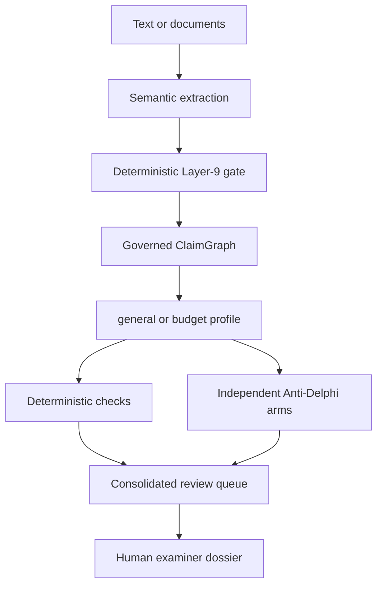
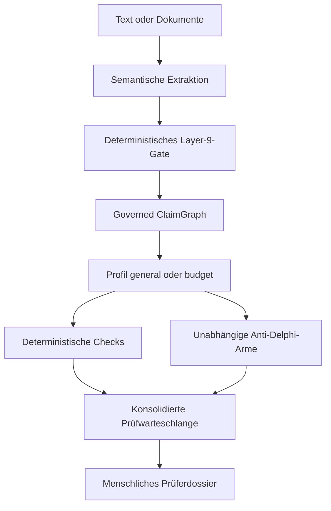

# Content Review

**An auditable content reviewer built on claims, not prose quality.**

[English](#english) · [Deutsch](#deutsch)

Content Review is a research alpha that helps a human examiner inspect the
internal substance of polished texts and proposals. It first decomposes the
source into atomic claims and typed relations. Only then do deterministic checks
and two independent Anti-Delphi reviewer arms look for contradictions, missing
support, overgeneralization, scope shifts and other tensions.

It is deliberately **not an AI detector**. Smooth writing receives no bonus,
rough writing no penalty. The system produces review questions, never a truth,
quality or funding verdict.

Status: `0.2.0a3` · Research alpha · MIT

---

## English

### What the examiner receives

The human-facing dossier starts with the content map and a short, prioritized
review queue. Each point contains:

- the issue and its severity;
- a concrete question for the examiner;
- the original claims and exact source wording;
- the reviewer paths that raised the issue;
- a technical audit with hashes, model provenance, rejected proposals and how
  much of the source the admitted claims are anchored to.

The same run also writes Markdown and a complete machine-readable JSON audit.
Agreement between reviewers is recorded as overlap, not treated as truth.

### Quick start: local web interface

Requirements: Python 3.11 or newer.

```bash
git clone https://github.com/hstre/Budget-Review.git
cd Budget-Review
python -m venv .venv
source .venv/bin/activate
pip install -e .
content-review web
```

On Windows PowerShell, activate the environment with:

```powershell
.venv\Scripts\Activate.ps1
```

The app opens at `http://127.0.0.1:8765` and provides German and English
navigation, settings, review controls and dossier labels.

Open **Settings** to add, replace or remove your DeepSeek API key. If no key is
available, the first live review directs you there automatically. Paste a text,
choose `general` or `budget`, and start the review. A live run may take a few
minutes.

Every completed web review also writes its full dossier to
`./review-output/web/<document>-<timestamp>/`, relative to the directory the
server was started in. `dossier.json` contains the verbatim wording of every
admitted claim, so place that directory accordingly.

### API-key handling

The local web interface stores one key per operating-system user in:

```text
~/.config/content-review/settings.json
```

The file is written atomically and set to `0600` on POSIX systems; Windows has
no equivalent and relies on the user profile ACL. The complete key is not
returned to the browser, written to dossiers or included in logs. It is stored
locally as plain text protected by the operating-system file permissions, not
encrypted. `DEEPSEEK_API_KEY` remains available as a fallback for CLI use.

The server binds to `127.0.0.1` by default. Binding to another address requires
the explicit `--allow-network` flag. This is a safety barrier, not multi-user
authentication: place a real authentication layer in front of the app before any
shared or public deployment.

### Try the offline controls

No API key is needed for the frozen controls:

```bash
content-review demo
content-review demo --case rough
content-review demo --profile budget --language en
```

They test the intended separation of form and content:

| Control | Governed graph | Deterministic result |
|---|---:|---:|
| `polished` | 5 claims, 5 relations | 3 structural findings |
| `rough` | 4 claims, 4 relations | 0 structural findings |

Zero findings are not a positive verdict. They only mean that the conservative
offline rules found none of their defined tensions in that graph.

### Completeness of the extraction

The gate can reject a claim but never add one. Everything after it — the
deterministic rules and both reviewer arms alike — is therefore bounded by what
the extractor proposed, and a claim that was never proposed is invisible to all
of them. The dossier it produces still looks clean.

Because every admitted claim carries the exact offsets of its source span, that
blind spot is measurable without a model. Each run reports the anchored share
of the document and names contiguous passages no admitted claim reaches. Each
named passage becomes a `coverage_gap` review point that quotes it and asks
whether it should have carried a claim.

The finding is a question, not a defect report. An uncovered passage may be a
heading, a transition, or genuinely claim-free prose; deciding that is the
examiner's. It therefore carries no claim IDs — a gap is defined by the absence
of one — and sits at the lowest severity.

**The anchored share is a descriptive statistic, not a score.** It moves with
how broadly the extraction contract defines a claim, not only with how well the
extractor worked. Measured against AbstRCT, a corpus of clinical abstracts with
expert-annotated argument spans, the same documents read 0.48 when every
annotated component counts and 0.14 when only conclusions do. A share is
comparable between runs of one contract and meaningless across different ones.
The gap list is the more dependable half, but it is not scale-free either. On
AbstRCT's 1700-character abstracts it accounts for 98% of the unanchored text,
so it decomposes the share rather than sampling it. On the 10k-to-40k-character
argumentation of court decisions it accounts for a median 72%, falling from 77%
below 15k characters to 63% above 30k, because 94% of the untouched stretches
between anchors fall under the 120-character threshold and their total mass
grows with the document. Read the list as a decomposition on short documents
and as the largest gaps only on long ones.

### What recall does with length

Coverage says how much of a document the claims touch. Whether the claims that
matter were among them needs a reference, and the answer turns out to depend
sharply on how long the document is. Measured against the argument spans of the
ECHR legal corpus:

| Document | Characters | Gold spans | Result |
|---|---:|---:|---|
| Frozen budget fixture | 1,707 | 25 | 25/25 found at 80% span overlap |
| Court decision 001-141170 | 10,308 | 24 | 16/24 at 80%, 18/24 at 50% |
| Court decision 001-110144 | 26,715 | 49 | no extraction: output truncated |

The middle row is the one to worry about. That run did not fail: it returned 43
claims, 27 relations and 13 findings, and nothing in the dossier announced that
a third of the expert-annotated argument had never entered the graph. The only
signal was the anchored share, 0.68 against the 0.95 the gold answer reaches on
the same document. The eight missed spans were not the long ones — missed and
found spans have the same median length — but mostly the Court's own reasoning
steps and its concluding finding.

Past roughly 27,000 characters the run stops instead, naming a truncated model
response, because a claim must be returned with its verbatim span and the reply
outgrows the output budget. A refusal is the better failure of the two, and it
is why truncation counts as fatal on the first response rather than being
retried.

That budget is self-imposed — the model allows 384,000 tokens — and raising it
turns out to help more than expected. At 65,536 tokens the same 26,715-character
decision produces 108 claims and reaches 36 of 49 gold spans at 80% overlap and
46 of 49 at 50%: a better strict recall than the shorter decision manages with
the same prompt, and not the thin dossier a bigger budget was feared to produce.
The anchored share still reports the shortfall, 0.82 against the gold answer's
0.98, so the warning survives the larger budget. It only moves the cliff
proportionally, though: 64k tokens reach roughly 110,000 characters, and the
longest decision in the corpus has 447,000.

Splitting the document does not repair it. Extracting the same decision in five
pieces of about 2,000 characters each — comparable to the fixture the extractor
handles perfectly — moved recall from 16/24 to 17/24 at 80% overlap, against a
pre-registered success mark of 20/24. It produced 52 claims instead of 43 and
raised the anchored share from 0.68 to 0.75, and at the looser 50% threshold it
did clearly better, 21/24 against 18/24: with less text per call the extractor
touches more of the argument, but still does not decompose it thoroughly.

That is the useful result, because it disconfirms the obvious explanation. If
context length were the cause, segments the size of the fixture should have
behaved like the fixture, and they did not. What separates the two documents is
not length but kind — dense legal prose with long citation-laden sentences
against a synthetic project proposal. Chunking costs five calls for one
additional span and is not the fix; the open question is what the extractor does
differently on this sort of text.

What did work was changing the question. Two passages of the extraction prompt
were written for project proposals: seven of its twenty-one claim types describe
a plan rather than an argument, and it asks to "decompose polished prose
aggressively: an elegant sentence may contain several claims", which describes
marketing copy and not a court subsuming facts in long clauses. Replacing just
those two passages, same model, same document, one call:

| Run | Calls | Claims | Recall @80% | Recall @50% | Anchored | Claims with no gold match |
|---|---:|---:|---:|---:|---:|---:|
| Production prompt | 1 | 43 | 16/24 | 18/24 | 0.68 | 30 |
| Five segments | 5 | 52 | 17/24 | 21/24 | 0.75 | 40 |
| Domain-neutral prompt | 1 | 40 | **20/24** | 21/24 | 0.76 | 23 |

The claim count is the telling part: the neutral prompt produces *fewer* claims
than the production one and still finds four more gold spans, with far fewer
claims that match no gold span at all. The problem was never how much the
extractor produced but where it aimed — which is also why segmenting, which
raised the volume without improving the aim, bought so little.

It loses nothing on the text it was written for: on the repo's own fixture the
neutral prompt still reaches all 25 gold claims, with 23 claims instead of 29
and an anchored share of 0.98 against 0.93 — fewer claims, better placed, the
same pattern again.

This is still one legal document, 24 spans, one run, and a bundle of two edits
whose individual contributions are unknown. It also does nothing about the
truncation above 27,000 characters.

Until then: the anchored share is the warning light. If it sits far below what
the document plausibly supports, the graph is thin, whatever the findings say.

### Review profiles

| Profile | Inspects | Explicitly does not inspect |
|---|---|---|
| `general` | argument structure, evidence links, logical gaps, contradictions, causality, scope and definition shifts, overgeneralization | writing quality, formatting, suspected AI authorship, external truth |
| `budget` | all general graph controls plus capacity, resources, percentages, FTE and budget totals | the funding decision |

`general` is the default. `budget` preserves and extends the original Budget
Review specialization on the same governed semantic core.

### How it works



The LLM is a sensor, not an authority. The gate admits only closed claim and
relation types with valid provenance, sufficient confidence and exact source
anchors. A malformed relation is rejected individually and recorded in the
audit; it is never silently converted into a guessed relation. No component can
set a claim to “true”.

The two live reviewer arms both currently use `deepseek-v4-flash`: one without
Thinking and one with Thinking. This creates perspective separation, not claimed
model diversity. Deterministic rules form the third path.

### Supported input and output

The CLI reads TXT, Markdown, CSV, TSV and DOCX. PDF and XLSX require the optional
document dependencies:

```bash
pip install -e '.[documents]'
```

Every completed review writes:

```text
dossier.html   human-facing review queue
dossier.md     portable text report
dossier.json   complete claims, relations, findings, provenance and rejections
```

### CLI examples

General content review:

```bash
export DEEPSEEK_API_KEY='...'
content-review review essay.md \
  --profile general \
  --provider deepseek \
  --live-review \
  --output review-output/essay
```

Proposal and budget review:

```bash
content-review review proposal.pdf budget.xlsx \
  --profile budget \
  --provider deepseek \
  --live-review \
  --language en \
  --output review-output/proposal
```

`--language de|en` sets the dossier language for HTML, Markdown and the reviewer
arms. Without it the stored interface language is used.

The old `budget-review` command remains as a compatible alias. A previously
extracted semantic packet can be reviewed offline with `--packet`.

### Authority boundaries

| Layer | May | Must not |
|---|---|---|
| Extractor | propose claims and relations | judge truth, style or authorship |
| Layer-9 gate | verify schema, spans, IDs, confidence and edges | repair gaps or invent claims |
| Deterministic checks | inspect explicit graph and numeric relations | add unstated assumptions |
| Coverage measurement | count anchored characters and name unanchored passages | decide that a gap is a defect |
| Anti-Delphi reviewers | propose content problems and review questions | issue an overall or majority verdict |
| Human examiner | inspect wording, evidence and meaning; make the final decision | — |

The full contracts are documented in [docs/architecture.md](docs/architecture.md).

### Tests

```bash
pip install -e '.[dev,documents]'
pytest
ruff check .
```

CI runs fully offline on Python 3.11, 3.12 and 3.13. The paid DeepSeek smoke test
is a separate manually triggered GitHub Action.

`scripts/measure_recall.py` scores an extraction against a frozen packet for the
same document, matching on span overlap rather than identity because two
extractions may split one sentence differently and both be right:

```bash
python scripts/measure_recall.py review-output/live/dossier.json \
  src/budget_review/fixtures/coherence_theatre/semantic_packet.json \
  src/budget_review/fixtures/coherence_theatre/proposal.md
```

The frozen packets serve as the reference because they were hand-built for this
extraction contract, so their scope matches what the extractor is asked for —
which a general argument-mining corpus cannot offer. For documents longer than
a packet covers, `scripts/echr_gold.py` builds a document and a gold packet
from the ECHR legal corpus, and `scripts/calibrate_coverage.py` re-derives the
two calibration figures quoted above from it. Both read a corpus checkout and
copy nothing into this repository.

### Alpha limitations

- The general profile inspects internal support, not the external truth of facts.
- Empty or incomplete ClaimGraphs are not positive results. Every run reports
  how much of the source its admitted claims are anchored to and names the
  passages none of them reach, but whether such a passage should have carried a
  claim is a question for the examiner, not a verdict.
- Live extraction quality remains model- and domain-dependent.
- The web alpha accepts pasted text; document upload remains a CLI feature.
- PDF extraction has no OCR.
- The dossier is rendered in German or English: interface labels, deterministic
  findings and the reviewer arms all follow `--language` (default: the stored
  interface setting). Quoted claims keep their original wording, since they are
  verbatim spans from the source.
- The local web server is single-user and has no account system.

Security details are collected in [SECURITY.md](SECURITY.md); changes per
release are in [CHANGELOG.md](CHANGELOG.md).

---

## Deutsch

### Was der Prüfer erhält

Das menschliche Dossier beginnt mit dem Inhaltsgerüst und einer kurzen,
priorisierten Prüfwarteschlange. Jeder Prüfpunkt enthält:

- Problem und Dringlichkeit;
- eine konkrete Frage für den Prüfer;
- die betroffenen Claims mit dem exakten Originalwortlaut;
- die Prüfwege, die den Hinweis erzeugt haben;
- einen technischen Audit mit Hashes, Modellprovenienz, Rejections und dem
  Anteil der Quelle, den die zugelassenen Claims verankern.

Daneben entstehen eine Markdown-Fassung und ein vollständiger
maschinenlesbarer JSON-Audit. Übereinstimmung zwischen Reviewern wird als
Überlappung dokumentiert, aber nicht als Wahrheit behandelt.

### Schnellstart: lokale Weboberfläche

Voraussetzung ist Python 3.11 oder neuer.

```bash
git clone https://github.com/hstre/Budget-Review.git
cd Budget-Review
python -m venv .venv
source .venv/bin/activate
pip install -e .
content-review web
```

Unter Windows PowerShell wird die Umgebung so aktiviert:

```powershell
.venv\Scripts\Activate.ps1
```

Die Anwendung öffnet `http://127.0.0.1:8765`. Navigation, Einstellungen,
Bedienelemente und Dossier-Bezeichnungen stehen auf Deutsch und Englisch zur
Verfügung.

Unter **Einstellungen** lässt sich der eigene DeepSeek API-Key eintragen,
ersetzen oder entfernen. Fehlt ein Schlüssel, führt die erste Live-Prüfung
automatisch dorthin. Anschließend Text einfügen, das Profil `general` oder
`budget` wählen und die Prüfung starten. Ein Live-Lauf kann einige Minuten
dauern.

Jede abgeschlossene Web-Prüfung schreibt ihr vollständiges Dossier zusätzlich
nach `./review-output/web/<dokument>-<zeitstempel>/`, relativ zum
Startverzeichnis des Servers. `dossier.json` enthält den Originalwortlaut aller
zugelassenen Claims; das Verzeichnis sollte entsprechend gewählt werden.

### Umgang mit dem API-Key

Die lokale Weboberfläche speichert einen Schlüssel je Betriebssystem-Benutzer:

```text
~/.config/content-review/settings.json
```

Die Datei wird atomar geschrieben und auf POSIX-Systemen auf `0600` gesetzt;
Windows kennt keine Entsprechung und verlässt sich auf die ACL des
Benutzerprofils. Der vollständige Key wird nicht an den Browser zurückgegeben
und erscheint weder in Dossiers noch in Logs. Er liegt lokal als Klartext vor
und wird durch die Dateirechte des Betriebssystems geschützt; er ist nicht
verschlüsselt. Für die CLI bleibt
`DEEPSEEK_API_KEY` als Rückfall verfügbar.

Der Server bindet standardmäßig nur an `127.0.0.1`. Andere Adressen verlangen
den ausdrücklichen Schalter `--allow-network`. Das ersetzt keine
Benutzeranmeldung: Vor einer gemeinsamen oder öffentlichen Bereitstellung muss
eine echte Authentifizierung vorgeschaltet werden.

### Offline ausprobieren

Die eingefrorenen Gegenproben benötigen keinen API-Key:

```bash
content-review demo
content-review demo --case rough
content-review demo --profile budget --language en
```

| Gegenprobe | Governed Graph | Deterministisches Ergebnis |
|---|---:|---:|
| `polished` | 5 Claims, 5 Relationen | 3 strukturelle Hinweise |
| `rough` | 4 Claims, 4 Relationen | 0 strukturelle Hinweise |

Null Hinweise sind kein positives Urteil. Sie bedeuten lediglich, dass die
konservativen Offline-Regeln in diesem Graphen keine der definierten Spannungen
gefunden haben.

### Vollständigkeit der Extraktion

Das Gate kann eine Aussage abweisen, aber keine ergänzen. Alles Nachfolgende —
die deterministischen Regeln wie beide Reviewer-Arme — ist deshalb durch das
begrenzt, was der Extraktor vorgeschlagen hat. Ein nie vorgeschlagener Claim
ist für sie alle unsichtbar, und das Dossier sieht trotzdem sauber aus.

Weil jeder zugelassene Claim seine exakten Quellpositionen mitführt, ist dieser
blinde Fleck ohne Modell messbar. Jeder Lauf weist den verankerten Anteil des
Dokuments aus und benennt zusammenhängende Passagen, die kein zugelassener
Claim erreicht. Jede benannte Passage wird zu einem Prüfpunkt `coverage_gap`,
der sie zitiert und fragt, ob dort eine Aussage hätte stehen müssen.

Der Befund ist eine Frage, keine Feststellung. Eine nicht erfasste Passage kann
eine Überschrift, eine Überleitung oder tatsächlich aussagefreier Text sein;
das entscheidet der Prüfer. Der Befund trägt deshalb keine Claim-IDs — eine
Lücke ist durch deren Abwesenheit definiert — und hat die niedrigste
Dringlichkeit.

**Der verankerte Anteil ist eine beschreibende Größe, keine Note.** Er hängt
davon ab, wie weit der Extraktionsvertrag „Claim“ fasst, nicht nur davon, wie
gut extrahiert wurde. Gemessen an AbstRCT, einem Korpus medizinischer Abstracts
mit fachlich annotierten Argument-Spans, liegen dieselben Dokumente bei 0,48,
wenn alle annotierten Komponenten zählen, und bei 0,14, wenn nur
Schlussfolgerungen zählen. Anteile sind zwischen Läufen desselben Vertrags
vergleichbar und über verschiedene Verträge hinweg bedeutungslos. Die
Lückenliste ist die belastbarere Hälfte, aber ebenfalls nicht längenunabhängig:
Bei den rund 1700 Zeichen langen AbstRCT-Abstracts deckt sie 98 % des
unverankerten Textes ab, zerlegt den Anteil also. Bei der 10.000 bis 40.000
Zeichen langen Argumentation von Gerichtsentscheidungen sind es im Median 72 %
— 77 % unterhalb von 15.000 Zeichen, 63 % oberhalb von 30.000 —, weil 94 % der
Zwischenräume unter der 120-Zeichen-Schwelle liegen und ihre Summe mit der
Dokumentlänge wächst. Auf kurzen Dokumenten ist die Liste eine Zerlegung, auf
langen nur noch die Aufzählung der größten Lücken.

### Was die Länge mit dem Recall macht

Die Abdeckung sagt, wie viel eines Dokuments die Claims berühren. Ob die
wichtigen Claims darunter waren, braucht eine Referenz — und die Antwort hängt
stark von der Dokumentlänge ab. Gemessen an den Argumentspannen des
EGMR-Rechtskorpus:

| Dokument | Zeichen | Gold-Spannen | Ergebnis |
|---|---:|---:|---|
| Eingefrorene Budget-Fixture | 1.707 | 25 | 25/25 bei 80 % Span-Überlappung |
| Entscheidung 001-141170 | 10.308 | 24 | 16/24 bei 80 %, 18/24 bei 50 % |
| Entscheidung 001-110144 | 26.715 | 49 | keine Extraktion: Ausgabe abgeschnitten |

Die mittlere Zeile ist die gefährliche. Dieser Lauf ist nicht gescheitert: Er
lieferte 43 Claims, 27 Relationen und 13 Befunde, und nichts im Dossier wies
darauf hin, dass ein Drittel der fachlich annotierten Argumentation nie in den
Graphen gelangt war. Das einzige Signal war der verankerte Anteil: 0,68 gegen
die 0,95, die die Gold-Antwort auf demselben Dokument erreicht. Die acht
verfehlten Spannen waren nicht die langen — gefundene und verfehlte haben
dieselbe Medianlänge —, sondern überwiegend die Subsumtionsschritte des
Gerichts und seine Schlussfolgerung.

Ab etwa 27.000 Zeichen bricht der Lauf stattdessen ab und benennt eine
abgeschnittene Modellantwort, weil zu jedem Claim die wörtliche Textstelle
zurückkommen muss und die Antwort das Ausgabebudget übersteigt. Von beiden
Fehlern ist der Abbruch der bessere — und der Grund, warum eine abgeschnittene
Antwort sofort als endgültig gilt und nicht wiederholt wird.

Dieses Budget ist selbstgesetzt — das Modell lässt 384.000 Token zu — und eine
Erhöhung hilft mehr als erwartet. Mit 65.536 Token liefert dieselbe Entscheidung
108 Claims und erreicht 36 von 49 Gold-Spannen bei 80 Prozent Überlappung und
46 von 49 bei 50 Prozent: ein besserer strenger Recall als bei der kürzeren
Entscheidung mit derselben Prompt — und nicht das dünne Dossier, das von einem
größeren Budget befürchtet wurde. Der verankerte Anteil meldet die Lücke
weiterhin, 0,82 gegen 0,98 der Gold-Antwort; die Warnleuchte überlebt das
größere Budget also. Sie verschiebt die Abbruchgrenze allerdings nur
proportional: 64k Token reichen grob bis 110.000 Zeichen, die längste
Entscheidung im Korpus hat 447.000.

Das Dokument zu teilen behebt es nicht. Dieselbe Entscheidung in fünf Stücken
von je rund 2.000 Zeichen extrahiert — vergleichbar mit der Fixture, die der
Extraktor vollständig zerlegt — bringt 17/24 statt 16/24 bei 80 % Überlappung,
gegen ein vorab festgelegtes Erfolgsmaß von 20/24. Es entstanden 52 statt 43
Claims, der verankerte Anteil stieg von 0,68 auf 0,75, und bei der lockereren
50-%-Schwelle war der Gewinn deutlich: 21/24 gegen 18/24. Mit weniger Text je
Aufruf berührt der Extraktor also mehr von der Argumentation, zerlegt sie aber
weiterhin nicht gründlich.

Genau das ist der brauchbare Befund, weil er die naheliegende Erklärung
widerlegt. Wäre die Kontextlänge die Ursache, hätten sich Segmente in
Fixture-Größe wie die Fixture verhalten müssen — haben sie nicht. Die beiden
Dokumente unterscheiden sich nicht in der Länge, sondern in der Art: dichte
Rechtsprosa mit langen, zitatgespickten Sätzen gegen einen synthetischen
Projektantrag. Das Zerteilen kostet fünf Aufrufe für eine zusätzliche Spanne
und ist nicht die Lösung; offen ist, was der Extraktor bei dieser Textsorte
anders macht.

Was gewirkt hat, war die geänderte Fragestellung. Zwei Stellen der
Extraktionsprompt sind an Projektanträgen entstanden: Sieben ihrer 21
Claim-Typen beschreiben einen Plan statt eines Arguments, und sie verlangt
„decompose polished prose aggressively: an elegant sentence may contain several
claims" — das beschreibt Werbetext, nicht ein Gericht, das in langen
Gliedsätzen subsumiert. Ersetzt man genau diese zwei Stellen, gleiches Modell,
gleiches Dokument, ein Aufruf:

| Lauf | Aufrufe | Claims | Recall 80 % | Recall 50 % | Verankert | Claims ohne Gold |
|---|---:|---:|---:|---:|---:|---:|
| Produktionsprompt | 1 | 43 | 16/24 | 18/24 | 0,68 | 30 |
| Fünf Segmente | 5 | 52 | 17/24 | 21/24 | 0,75 | 40 |
| Neutrale Prompt | 1 | 40 | **20/24** | 21/24 | 0,76 | 23 |

Die Claim-Zahl ist das Aufschlussreiche: Die neutrale Fassung erzeugt *weniger*
Claims als die Produktionsfassung und findet trotzdem vier Gold-Spannen mehr,
bei deutlich weniger Claims ohne jede Gold-Entsprechung. Es ging nie um die
Menge, sondern um das Ziel — weshalb auch die Segmentierung so wenig brachte:
Sie erhöhte die Menge, ohne die Treffsicherheit zu ändern.

Auf dem Text, für den sie geschrieben wurde, verliert sie nichts: Auf der
eigenen Fixture erreicht die neutrale Prompt weiterhin alle 25 Gold-Claims, mit
23 statt 29 Claims und einem verankerten Anteil von 0,98 gegen 0,93 — wieder
weniger Claims, besser platziert.

Es bleibt ein Rechtsdokument, 24 Spannen, ein Lauf, und ein Bündel aus zwei
Eingriffen, deren Einzelbeiträge offen sind. Am Abbruch oberhalb von 27.000
Zeichen ändert es nichts.

Bis dahin gilt: Der verankerte Anteil ist die Warnleuchte. Liegt er deutlich
unter dem, was das Dokument plausibel hergibt, ist der Graph dünn — unabhängig
davon, was die Befunde sagen.

### Prüfprofile

| Profil | Prüft | Prüft ausdrücklich nicht |
|---|---|---|
| `general` | Argumentstruktur, Evidenzbezug, logische Lücken, Widersprüche, Kausalität, Scope- und Begriffswechsel, Verallgemeinerungen | Stilqualität, Formatierung, vermutete KI-Autorenschaft, externe Wahrheit |
| `budget` | zusätzlich Kapazität, Ressourcen, Prozentangaben, FTE und Budgetsumme | Förderentscheidung |

`general` ist der Standard. `budget` erhält und erweitert das frühere Budget
Review als Spezialprofil auf demselben semantischen Kern.

### Funktionsweise



Das LLM ist Sensor, nicht Autorität. Das Gate lässt nur geschlossene Claim- und
Relationstypen mit gültiger Provenienz, ausreichender Konfidenz und exakter
Originalstelle zu. Eine fehlerhafte Relation wird einzeln abgewiesen und im
Audit dokumentiert; sie wird niemals still in eine vermutete Relation
umgedeutet. Keine Komponente kann einen Claim auf „wahr“ setzen.

Beide Live-Reviewer verwenden derzeit `deepseek-v4-flash`: ein Arm ohne
Thinking, ein unabhängiger Arm mit Thinking. Das ist Perspektivtrennung, keine
behauptete Modellvielfalt. Die deterministischen Regeln bilden den dritten
Prüfweg.

### Eingaben und Ausgaben

Die CLI liest TXT, Markdown, CSV, TSV und DOCX. PDF und XLSX benötigen die
optionalen Dokumentabhängigkeiten:

```bash
pip install -e '.[documents]'
```

Jede abgeschlossene Prüfung erzeugt:

```text
dossier.html   menschliche Prüfwarteschlange
dossier.md     übertragbarer Textbericht
dossier.json   Claims, Relationen, Findings, Provenienz und Rejections
```

### CLI-Beispiele

Allgemeine Inhaltsprüfung:

```bash
export DEEPSEEK_API_KEY='...'
content-review review essay.md \
  --profile general \
  --provider deepseek \
  --live-review \
  --output review-output/essay
```

Antrags- und Budgetprüfung:

```bash
content-review review antrag.pdf budget.xlsx \
  --profile budget \
  --provider deepseek \
  --live-review \
  --language de \
  --output review-output/antrag
```

`--language de|en` bestimmt die Sprache von HTML, Markdown und den
Reviewer-Armen. Ohne den Schalter gilt die gespeicherte Oberflächensprache.

Der frühere Befehl `budget-review` bleibt als kompatibler Alias erhalten. Ein
bereits extrahiertes Semantic Packet kann mit `--packet` vollständig offline
geprüft werden.

### Autoritätsgrenzen

| Schicht | Darf | Darf nicht |
|---|---|---|
| Extraktor | Claims und Relationen vorschlagen | Wahrheit, Stil oder Autorenschaft bewerten |
| Layer-9-Gate | Schema, Spans, IDs, Konfidenz und Kanten prüfen | Lücken schließen oder Claims erfinden |
| Regelprüfer | explizite Graph- und Zahlenbeziehungen prüfen | ungenannte Annahmen ergänzen |
| Abdeckungsmessung | verankerte Zeichen zählen, unverankerte Passagen benennen | eine Lücke zum Mangel erklären |
| Anti-Delphi | Inhaltsprobleme und Prüffragen vorschlagen | Gesamturteil oder Mehrheitsvotum abgeben |
| Mensch | Wortlaut, Belege und Bedeutung prüfen; endgültig entscheiden | — |

Die vollständigen Verträge stehen in [docs/architecture.md](docs/architecture.md).

### Tests

```bash
pip install -e '.[dev,documents]'
pytest
ruff check .
```

Die CI läuft unter Python 3.11, 3.12 und 3.13 vollständig offline. Der
kostenpflichtige DeepSeek-Smoke-Test ist davon getrennt und wird in GitHub
Actions manuell gestartet.

`scripts/measure_recall.py` bewertet eine Extraktion gegen ein eingefrorenes
Packet desselben Dokuments. Verglichen wird über Span-Überlappung statt über
Identität, weil zwei Extraktionen denselben Satz unterschiedlich schneiden und
beide recht haben können:

```bash
python scripts/measure_recall.py review-output/live/dossier.json \
  src/budget_review/fixtures/coherence_theatre/semantic_packet.json \
  src/budget_review/fixtures/coherence_theatre/proposal.md
```

Die eingefrorenen Packets dienen als Referenz, weil sie für genau diesen
Extraktionsvertrag von Hand gebaut wurden — ihr Umfang passt also zu dem, was
der Extraktor liefern soll. Ein allgemeiner Argument-Mining-Korpus kann das
nicht bieten. Für Dokumente jenseits der Packet-Länge baut
`scripts/echr_gold.py` ein Dokument samt Gold-Packet aus dem EGMR-Rechtskorpus,
und `scripts/calibrate_coverage.py` leitet die beiden oben genannten
Kalibrierungswerte daraus neu her. Beide lesen einen Korpus-Checkout und
kopieren nichts in dieses Repository.

### Grenzen der Alpha

- Das allgemeine Profil prüft interne Tragfähigkeit, nicht die externe Wahrheit
  von Tatsachenbehauptungen.
- Ein leerer oder unvollständiger ClaimGraph ist kein positives Ergebnis. Jeder
  Lauf weist aus, welcher Anteil der Quelle von zugelassenen Claims verankert
  ist, und benennt Passagen ohne Anker; ob eine solche Passage eine Aussage
  hätte tragen müssen, entscheidet der Prüfer.
- Die Qualität der Live-Extraktion bleibt modell- und domänenabhängig.
- Die Web-Alpha akzeptiert eingefügten Text; Dokument-Upload ist noch eine
  CLI-Funktion.
- PDF-Extraktion enthält kein OCR.
- Das Dossier erscheint auf Deutsch oder Englisch: Bezeichnungen,
  deterministische Befunde und die Reviewer-Arme folgen `--language`
  (Vorgabe: die gespeicherte Spracheinstellung). Zitierte Claims behalten ihren
  Wortlaut, weil sie exakte Originalstellen sind.
- Der lokale Webserver ist für einen Benutzer ausgelegt und besitzt noch kein
  Kontensystem.

Sicherheitsdetails stehen in [SECURITY.md](SECURITY.md), die Änderungen je
Version in [CHANGELOG.md](CHANGELOG.md).
